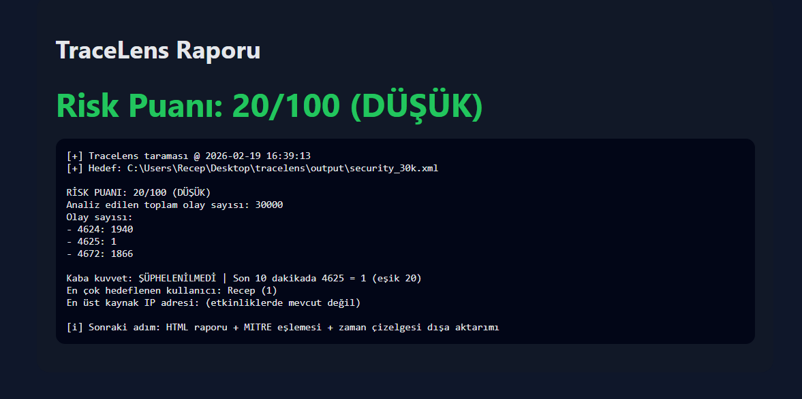

# TraceLens


TraceLens is a lightweight DFIR triage tool that analyzes Windows Security Event Logs and turns raw evidence into a human-readable risk report within seconds.

No SIEM.
No agent.
Just logs.

---

## Quick start
```powershell
# Export Security log (Windows)
wevtutil qe Security /f:xml /c:30000 | Out-File .\output\security_30k.xml -Encoding utf8

# Scan + generate HTML report
python .\tracelens.py scan .\output\security_30k.xml --html

# Open report
start .\reports\tracelens_report.html

# TraceLens
Windows Event Log First Response & Triage Tool (EVTX)

> You don’t read logs. You see intent.

## What it does
TraceLens scans Windows Security logs and produces a quick triage summary:
- Failed logons (4625) / brute-force signals
- Successful logons (4624)
- Privileged logons (4672)
- New user creation (4720)
- Log clearing (1102)
- RDP logons (1149)

## Quick start
```bash
pip install -r requirements.txt
python tracelens.py scan ./evtx
RISK SCORE: 82/100 (HIGH)
- Possible brute force (RDP)
- Privileged logon detected
- Event logs cleared (1102)
Report: reports/incident_YYYY-MM-DD.html
## Proof (real run)
```text
RISK SCORE: 20/100 (LOW)
Total events parsed: 30000
Event counts:
- 4624: 1940
- 4625: 1
- 4672: 1866

Brute-force: NOT SUSPECTED | 4625 in last 10 min = 1 (threshold 20)
Top targeted user: Recep (1)
Top source IP: (not present in events)

---

## Commit + push
```powershell
git add tracelens.py README.md
git commit -m "improve evidence output and add proof to README"
git push
## Proof (real run)
```text
RISK SCORE: 20/100 (LOW)
Total events parsed: 30000
Event counts:
- 4624: 1940
- 4625: 1
- 4672: 1866

Brute-force: NOT SUSPECTED | 4625 in last 10 min = 1 (threshold 20)
Top targeted user: Recep (1)
Top source IP: (not present in events)

---

## 3) Test et (çıktı artık daha tok olacak)
```powershell
python .\tracelens.py scan .\output\security_30k.xml


